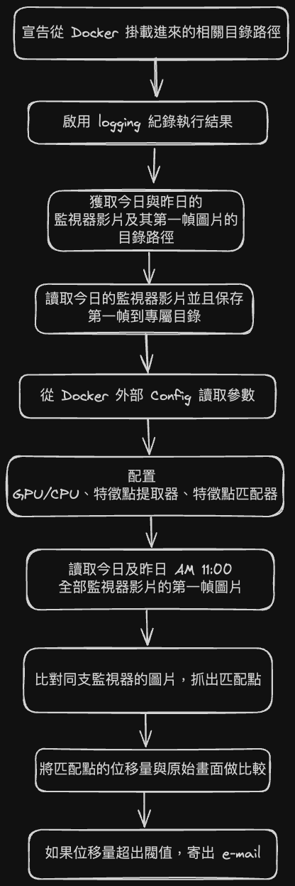

# Lunch APP
## Get docker-compose.yml
## Start Docker Compose
```sh
sudo docker compose up && sudo docker compose down
```
Can not use "docker run". Because "docker run" do not support NAT_PATH="/run/user/1000/gvfs/smb-share:server=192.168.104.252,share=omo/CMS_data/record"
## Camera Angle Detection Flow
