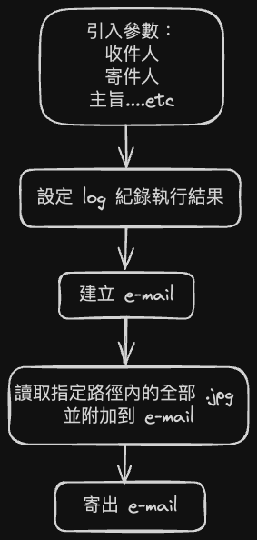

# Lunch APP
## Step 1 : Build a image
```sh
sudo docker build --tag solaxie/dect_camera_angle:v1.0 .
```
## Step 2 : Get docker image & docker-compose.yml
## Step 3 : Start Docker Compose
```sh
sudo docker compose up && sudo docker compose down
```
Note: Can not use "docker run". Because "docker run" do not support NAT_PATH="/run/user/1000/gvfs/smb-share:server=192.168.104.252,share=omo/CMS_data/record"
## Camera Angle Detection Flow

## Send E-mail Flow
